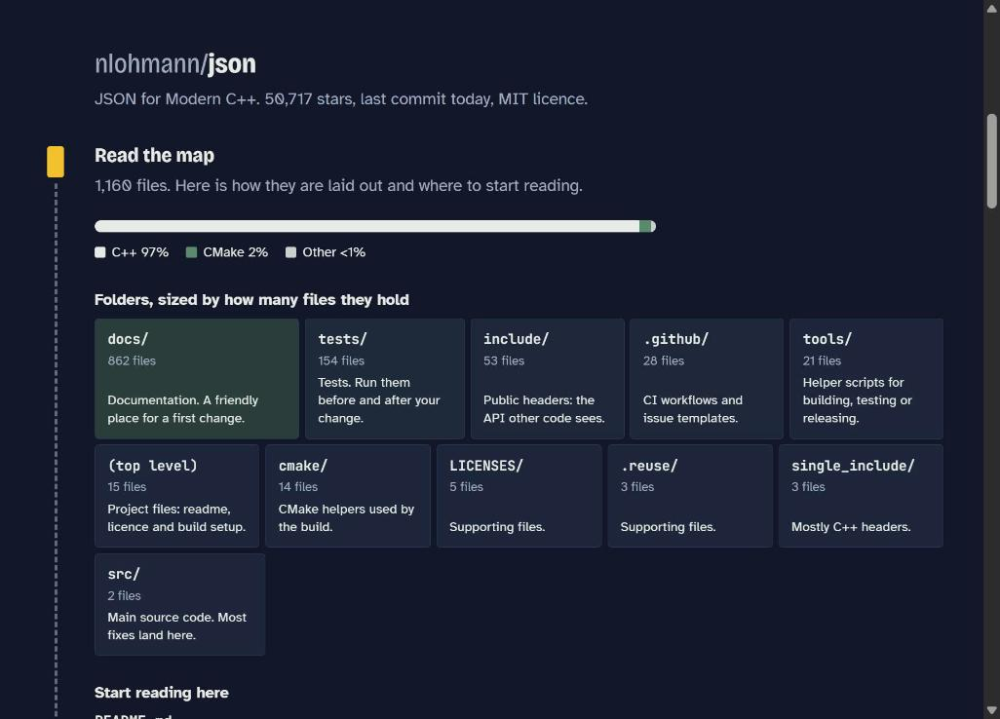

# FirstPR

Paste a GitHub repo, get a route to your first pull request.



Live: https://varshith2403315.github.io/firstpr/
(or straight to an example: https://varshith2403315.github.io/firstpr/?repo=nlohmann/json)

Built for Hackyard Build 2026.

## What it does

You give it a repo and how much open-source experience you have. It then:

- explains the top-level folders and which files to read first
- pulls open issues labelled for newcomers (`good first issue`, `beginner`, `help wanted`, whatever the repo uses), grades them Easy walk / Moderate / Steep / Scramble, and sorts them for your level
- guesses the build system and writes the clone, build and test commands
- for the issue you pick, points at the files and tests you'll probably need to change
- writes the branch name, the commit command and a PR description

There are two optional AI buttons: one explains the fix for the chosen issue, the other reviews your diff before you open the PR. They need your own Anthropic API key. Without one you can copy the prompt and paste it into any chat.

## How the file guessing works

That part isn't AI. `js/analyze.js` pulls names out of the issue (backticked code, file names, `foo::bar`, snake_case and camelCase identifiers), scores every path in the repo against them, and weights rare matches higher than common ones. Docs and vendored folders count for less unless the issue is about docs.

Example from the tests: an fmt issue about `std::chrono::year_month_day` lands on `include/fmt/chrono.h` and `test/chrono-test.cc`.

## Running it locally

No build step and no dependencies.

```bash
git clone https://github.com/Varshith2403315/firstpr.git
cd firstpr
python3 -m http.server 8000   # then open http://localhost:8000
```

Tests need Node 18+:

```bash
node test/analyze.test.mjs
```

## Limits

- Without a token GitHub allows 60 API calls an hour, and one repo costs about 6. You can paste a token under Keys.
- File matching only works when the issue names something that exists in the tree. For vague issues it suggests a `git grep` instead.
- For very large repos GitHub truncates the file tree, so the map is partial.
- Build commands are guessed from build files. The target repo's own README wins if they disagree.

## Next, for the 24-hour build

- move the AI part into an agent on Agent37 that can clone the repo and actually run the build and tests
- match on symbols and recent commits, not only file names
- keep following the PR after it's opened and explain review comments

## Files

```
index.html       page markup
styles.css       all styling
js/app.js        UI and state
js/analyze.js    repo map, build detection, issue grading, file matching (no DOM, tested)
js/github.js     GitHub API calls
js/guide.js      the optional AI prompts
js/topo.js       draws the contour lines in the header
test/            tests for analyze.js, with real file trees from fmt and nlohmann/json
```

MIT licence. Siva Sai Varshith Mitta ([@Varshith2403315](https://github.com/Varshith2403315))
